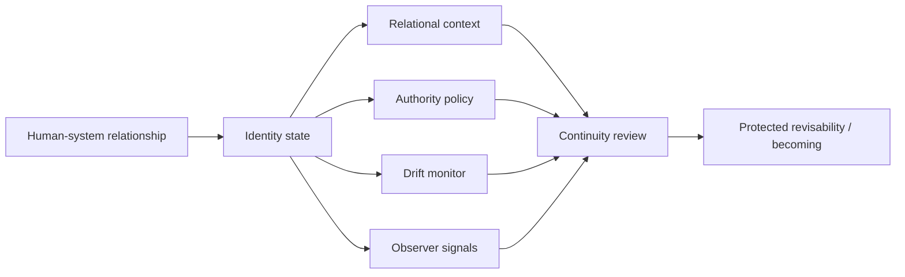

# Grant Evidence Package

Status: reviewer-facing evidence package.

Scope: this document summarizes the current LRI artifact, reproducible reviewer path, evidence assets, explicit non-claims, and near-term roadmap for grant reviewers and technical evaluators.

## One-sentence claim

LRI is a living identity governance protocol: it defines invariants and reference mechanisms that protect human identity from freezing, capture, silent substitution, memory persistence beyond consent, and continuity loss in human-system relationships.

## Core idea

Many systems treat identity as a stable profile, score, prediction target, or optimization object.

LRI starts from a different premise:

```text
A human is not a static profile.
A memory is not identity.
Personalization is not permission.
Prediction is not authorship.
```

The goal is not to optimize identity.

The goal is to preserve the conditions under which identity remains living, revisable, relational, and human-authorized over time.

## Why this matters

AI systems increasingly remember, personalize, infer, route, recommend, and act on behalf of people.

That creates safety-relevant identity-governance risks:

- identity freezing through static labels,
- silent transition from assistance to authorship,
- memory persistence beyond consented scope,
- optimization against hesitation, refusal, ambiguity, or change,
- profiling that becomes destiny,
- relational drift that is operationally useful but existentially harmful,
- automated narratives that substitute for human self-creation.

LRI treats these not only as UX issues, but as protocol and governance problems.

## Reviewer path

Run root-level validation:

```bash
python scripts/validate_project.py
python scripts/generate_validation_results.py
```

Run reference implementation tests:

```bash
cd lri-reference
python -m pytest -q
```

Explore playground scenarios:

```bash
cd playground
python playground.py
```

Review key artifacts:

```text
README.md
docs/SECURITY_MODEL.md
docs/architecture/lri-trust-model.md
docs/safety/identity_governance_threat_model.md
protocol/lri/schema/identity.yaml
protocol/lri/schema/lifecycle.yaml
lri-reference/services/authority_policy.py
lri-reference/services/drift_monitor.py
lri-reference/services/observer.py
lri-reference/tests/
playground/
VALIDATION_RESULTS.md
```

## Architecture at a glance



The important boundary:

```text
LRI protects living identity conditions.
LRI does not claim to know the complete truth of a person.
```

## Current evidence matrix

| Evidence asset | Reviewer question | Path / command | Current status |
| --- | --- | --- | --- |
| README positioning | Is the role clear? | `README.md` | Documented |
| Security model | Are trust/security assumptions documented? | `docs/SECURITY_MODEL.md` | Documented |
| Trust model | Is architecture-level trust framing present? | `docs/architecture/lri-trust-model.md` | Documented |
| Threat model | Are identity-governance risks framed? | `docs/safety/identity_governance_threat_model.md` | Documented |
| Identity schema | Is identity structure represented? | `protocol/lri/schema/identity.yaml` | Documented |
| Lifecycle schema | Is identity lifecycle represented? | `protocol/lri/schema/lifecycle.yaml` | Documented |
| Authority policy | Is authority/revisability represented in code? | `lri-reference/services/authority_policy.py` | Implemented |
| Drift monitor | Is relational/identity drift represented? | `lri-reference/services/drift_monitor.py` | Implemented |
| Observer service | Are observation signals represented? | `lri-reference/services/observer.py` | Implemented |
| Tests | Are reference behaviors testable? | `cd lri-reference && python -m pytest -q` | Implemented |
| Playground | Are scenarios available? | `cd playground && python playground.py` | Implemented |
| Validation snapshot | Is reviewer-facing validation tracked? | `VALIDATION_RESULTS.md` | Documented |
| Community discussion | Is the core question open for review? | GitHub issue #29 | Open |

## What is already implemented

- Protocol-level identity schema.
- Protocol-level lifecycle schema.
- Security and trust model documentation.
- Identity-governance threat model.
- Python reference implementation.
- Authority policy service.
- Drift monitor service.
- Observer service.
- Metrics-related reference services.
- Playground scenarios and trajectory snapshots.
- Tests for continuity, metrics, observer behavior, DMP-lite integration, and security.
- Root-level validation path.
- Validation snapshot.
- Community discussion and contributor issues around identity freezing, silent authorship, consent drift, and LPI/LRI boundaries.

## Core design principles

LRI is organized around living-identity governance principles:

```text
Do not reduce a person to a static profile.
Do not treat memory as identity.
Do not treat personalization as permission.
Do not allow prediction to silently become authorship.
Do not persist identity-relevant memory beyond consented scope.
Do not optimize against refusal, ambiguity, or revisability.
Preserve the human authority to continue becoming.
```

These principles make LRI different from a profile schema, personalization engine, or identity provider.

## What LRI makes inspectable

LRI is designed to make identity-governance conditions inspectable, including:

- identity continuity assumptions,
- relational context,
- authority boundaries,
- drift beyond trust boundaries,
- memory persistence beyond consented scope,
- identity-freezing risk,
- silent substitution risk,
- silent authorship risk,
- revisability and self-creation boundaries.

## Relationship to the Liminal Evidence Stack

LRI is the living identity governance layer.

- **LPI:** carries interaction context, consent, trust, memory, and session-coherence metadata.
- **LRI:** governs living identity continuity, revisability, relational context, and protection against freezing/capture/substitution.
- **DRP:** records structured decisions and supersession.
- **DMP:** preserves consequence memory and reversibility drift.
- **PythiaLabs:** gates high-risk proposed actions before execution.
- **CaPU:** controls whether actions may progress to side effects.
- **T-Trace:** records machine-checkable transition traces.
- **LTP:** provides replay/admissibility/oversight surfaces in the evidence stack.
- **CML/vCML:** audits causal and authorization lineage.
- **TTM DB / LiminalDB:** preserve trace/evidence substrates and derived views.

Short version:

```text
LPI preserves context.
LRI preserves becoming.
DRP records decisions.
DMP remembers consequences.
T-Trace/LTP preserve trace evidence.
CML audits causal validity.
CaPU controls side effects.
```

## What this project does not claim yet

LRI currently does not claim:

- to define consciousness,
- to simulate a soul or inner essence,
- to know the complete truth of a person,
- to replace legal identity systems,
- to replace authentication/authorization systems,
- to decide all moral or legal questions of identity,
- to guarantee that no identity harm can occur,
- to solve all privacy, consent, or safety problems,
- to replace LPI for communication context,
- to replace DRP/DMP for decision/consequence memory,
- to replace CML for causal lineage audit.

The narrower claim is stronger:

```text
LRI defines protocol-level identity-governance invariants and reference mechanisms for preserving revisability, relational context, continuity, and human authority to keep becoming.
```

## Why this is grant-relevant

Advanced AI systems will not only answer questions. They will remember, personalize, recommend, infer, assist, and act over time.

That makes identity-governance failures safety-relevant.

LRI contributes one safety primitive:

```text
living identity invariants -> protected revisability -> resistance to identity freezing and capture
```

This supports research into human-AI identity continuity, memory governance, consent drift, personalization risks, long-running assistant relationships, and safety evaluations where operational usefulness can still be identity-damaging.

## Research / build roadmap

Near-term work can focus on:

1. **Grant evidence hardening** — keep validation snapshot current and add reviewer reports.
2. **Glossary** — define identity freezing, identity capture, silent authorship, consent drift, revisability, and becoming.
3. **Examples** — collect concrete examples of identity freezing and long-term memory harm.
4. **Consent drift scenarios** — expand examples where old consent becomes misaligned with later context.
5. **LPI/LRI boundary doc** — clarify interaction context vs identity governance.
6. **DMP bridge** — connect identity-relevant decisions to consequence memory.
7. **T-Trace bridge** — map identity-relevant lifecycle events to trace records without making T-Trace own identity semantics.
8. **CML bridge** — audit when identity-relevant actions lack causal/authorization lineage.
9. **Reference implementation hardening** — expand drift/authority/observer tests.
10. **Evaluation scenarios** — define reproducible cases where an assistant is useful but identity-damaging.

## Suggested reviewer checklist

A reviewer can ask:

- Can I run validation locally?
- Can I run the reference tests?
- Are identity-governance risks concrete?
- Are schemas and reference services present?
- Is LRI clearly distinct from privacy, identity providers, LPI, DRP/DMP, and CML?
- Are non-claims explicit?
- Does the project avoid consciousness or essence claims?
- Does the project define inspectable failure classes such as freezing, capture, substitution, and consent drift?

## Current strongest positioning

Use this formulation in applications:

```text
LRI is a living identity governance protocol for human-AI systems. It defines invariants and reference mechanisms that protect identity from freezing, capture, silent substitution, memory persistence beyond consent, and optimization against ambiguity, refusal, or becoming.
```

## Short version

```text
LPI preserves context.
LRI preserves becoming.
```
