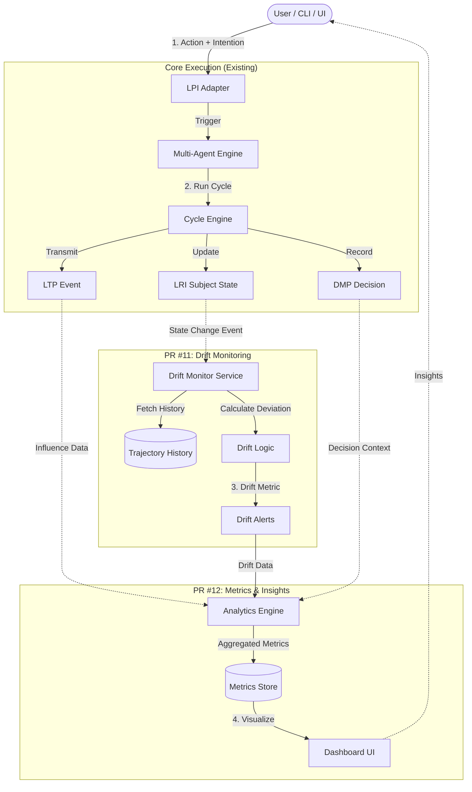

# LRI Drift & Metrics Architecture (PR #11-12)

This document outlines the architectural flow for the upcoming Drift Monitoring (PR #11) and Metrics Dashboard (PR #12) modules. It visualizes how these components integrate with the existing LRI Core and Multi-Agent Engine to transform the system into a self-regulating "organism".

## Conceptual Flow

The system evolves from a passive simulator to an active monitoring environment:
1.  **LPI (Action)**: User or Agent initiates an action.
2.  **LRI Cycle**: The core engine processes the action, recording decisions (DMP) and updating identity state (LRI).
3.  **Drift Monitor (New)**: Asynchronously analyzes the new state against historical trajectories or expected baselines to detect "Identity Drift".
4.  **Metrics Store (New)**: Aggregates drift data, influence events (LTP), and interaction outcomes.
5.  **Dashboard (New)**: Visualizes the health, stability, and influence of agents in real-time.

## Architecture Diagram

## Component Breakdown

### 1. Drift Monitor (PR #11)
*   **Input**: Updates to `IdentityState.trajectory`.
*   **Logic**: Calculates the semantic distance between the `intention` of recent actions and the agent's core `role` or historical baseline.
*   **Output**: A `drift_score` (0.0 - 1.0) and status (`STABLE`, `DRIFTING`, `UNSTABLE`).

### 2. Analytics Engine (PR #12)
*   **Influence Metric**: Tracks how often an agent's LTP transmissions cause state changes in other agents (target trajectories).
*   **Continuity Score**: Aggregates continuity checks over time.
*   **ROI**: (Optional) Measures the "value" of an action based on context success.

### 3. Dashboard (PR #12)
*   **Drift Heatmap**: Visualizing which agents are deviating from their norms.
*   **Influence Graph**: Network graph showing who influences whom (Actor -> Target).
